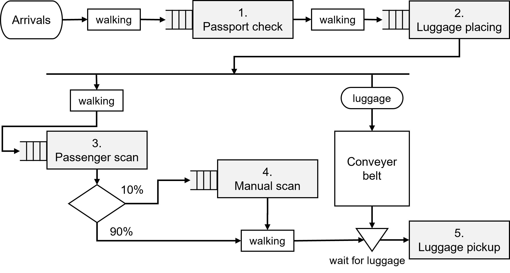

# Description
This SUT _Airport_ is an ABM of the check-in process for passengers at an Airport. It consists of several servers with queues in series, that the passengers should traverse, with some walking time between the servers. There are some conditional and parallel servers as well: only 10% of passengers is send to the 'Manual scan'. The last server is 'Luggage pickup'. This has unlimited capacity (so no queue). However, passenger can only go in service here, if their luggage has arrived. 

The test package can test similar components within this SUT, namely the servers with queue. One server can be tested at a time; the name of the `server_under_test` can be specified from the test execution script. The test model only checks one aspect of the servers, namely whether the service times are within the expected distributions for the chosen server. 

The test model does this by monitoring the arrivals and departures from each server in the SUT. These are passed by the SUT with simple messages, in the format `'arrival <server name>'` or `departure <server name>'`. 

## Details about SUT
The functional requirements of the SUT are taken from a study exercise. Note that most of the described behavior can't be tested in the test package; only the service time distributions are for four servers can be tested.

Taken from the associated [thesis report](https://repository.tudelft.nl/islandora/object/uuid:7a6ee58b-af74-450a-a54b-8511aae898e6?collection=education):

> The system is a passenger check-in of a small airport. A new passenger arrives on average every 60 s. Passengers
first go through a passport check, which takes between 30 s to 90 s with a median of 45 s. Then one
passenger at a time can place one piece of hand luggage on an accumulating conveyor belt. Luggage
drop-off takes between 20 s to 40 s. A piece of luggage traverses the belt of 10 m with a speed of
0.5 m/s. Meanwhile, a passenger goes through a scanner, which takes 30 s to 85 s. A subsequent
manual check is needed for 10% of passengers. Only one passenger can be checked manually at a
time. After these scans, passengers can pick up their luggage, if it has traversed the conveyor belt.
Picking up the luggage takes between 20 s to 40 s. There is a walking distance of 5 meters between
all processes and the passengers walk with an average speed of 2.5 km/h.



# How to run
This test package can be executed in two ways. Note that the SUT is placed in the 'tests' folder; this is so that it can also be run from the CLI. 

## 1. From CLI
To execute from the CLI, use from this folder:
```console
altwalker online -m models/Components.json "weighted_random(requirement_coverage(100))" tests
```

This will run the test, and use predefined settings for the SUT as given in `test.py`.

## 2. From test execution script
A single test run can be started by executing `Airport_test_execution.py`.

The test model only tests one component, a server with queue, from the SUT. Which component is tested, can be selected from the test script by setting `server_under_test`. This can be changed to either `passport_check`, `luggage_placing`, `passenger_scan`, or `manual_check`. The following (expected) properties of these servers are then passed to the abstract model as graph variables:
- `service_time_min`: Minimal service time at server
- `service_time_max`: Maximal service time at server
- `server name`: Name of server

The following settings of the SUT can be set from the test execution script:
- `seed_SUT`: The seed used by Mesa in the SUT.

The following settings for the test run can be set from the test execution script:
- `t_end`: The number of ticks in the SUT, at which the test should end.
- `show_messages`: Boolean. If True, the messages sent by the SUT will be printed.

# Bonus: Two_servers
An earlier version of this test package can be found in the 'Two_servers' folder. The SUT here is `Two_servers_ABM_better.py`, a simplified version of the _Airport_ model with only the 'Passport check' and 'Luggage placing' servers working. 
The exact same abstract model `Components.json` is used to test these servers.

A very similar SUT `Two_servers_ABM.py` is provided as well. This SUT has some known faults: the number in queue is sometimes not updated correctly, because all agents are executed in a random order. This SUT can be tested by changing line 5 in `test.py` to:
```
from . import Two_server_ABM as SUT
```

Running a test with this SUT can demonstrate how the test package detects failures of the SUT.

Test execution can again be done from a test execution script or from the CLI in the same manner.


